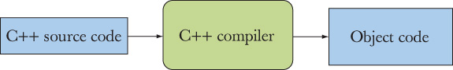
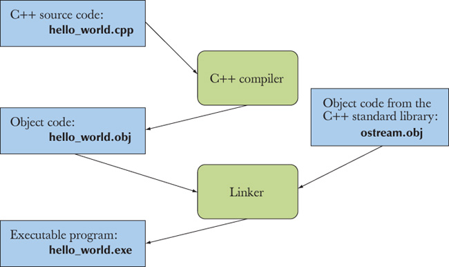

# Hello, World!

Programs in c++ start by executing the main function 

**Functions** : is a named sequence of instructions for the computer to execute in the order. A function has mainly four parts

- A return type
- A name
- A parameter list
- A function body is  a list of statements

**Compilers** : programs that turns source code into a machine executable object code 

**linker:** a program that combines object code files and libraries into an executable program.

A program usually consists of several separate parts, often developed by different people. For example, the “Hello, World!” program consists of the part we wrote plus parts of the C++ standard library. These separate parts (sometimes called translation units) must be compiled and the resulting object code files must be linked together to form an executable program. The program that links such parts together is (unsurprisingly) called a linker

Note that object code is not portable