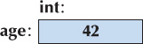

# Objects, Types and Values

**Object :**  a place in memory which holds a value of some type, and a named object is called a **variable** 

We can think of an object like a box that holds value type, here we have a object of type int that named age and holds the value 42.



<aside>
💡 Types and objects

- A *type* defines a set of possible values and a set of operations (for an object).
- An *object* is some memory that holds a value of a given type.
- A *value* is a set of bits in memory interpreted according to a type.
- A *variable* is a named object.
- A *declaration* is a statement that gives a name to an object.

</aside>

C++ provides a large number of types but here is the essentials: 

 

```cpp
int number_of_steps = 39;             // int for integers
double flying_time = 3.5;             // double for floating-point numbers
char decimal_point = '.';             // char for individual characters
string name = "Annemarie";            // string for character strings
bool tap_on = true;                   // bool for logical variables
```

Note that the operators << and >> are type sensitive 

   

<details>
    <summary>Here is a table of useful operators for some common and useful types:</summary>

|  | bool | char | int | double | string |
| --- | --- | --- | --- | --- | --- |
| assignment | = | = | = | = | = |
| addition |  |  | + | + |  |
| concatenation |  |  |  |  | + |
| subtraction |  |  | – | – |  |
| multiplication |  |  | * | * |  |
| division |  |  | / | / |  |
| remainder (modulo) |  |  | % |  |  |
| increment by 1 |  |  | ++ | ++ |  |
| decrement by 1 |  |  | –– | –– |  |
| increment by n |  |  | += n | += n |  |
| add to end |  |  |  |  | += |
| decrement by n |  |  | –= n | –= n |  |
| multiply and assign |  |  | *= | *= |  |
| divide and assign |  |  | /= | /= |  |
| remainder and assign |  |  | %= |  |  |
| read from s into x | s >> x | s >> x | s >> x | s >> x | s >> x |
| write x to s | s << x | s << x | s << x | s << x | s << x |
| equals | == | == | == | == | == |
| not equal | != | != | != | != | != |
| greater than | > | > | > | > | > |
| greater than or equal | >= | >= | >= | >= | >= |
| less than | < | < | < | < | < |
| less than or equal | <= | <= | <= | <= | <= |
</details>


Note that ‘=’ is not ‘equal’ but it’s an ‘assignment’ operator 

Initialization (giving a variable its initial value)

Assignment (giving a variable a new value)

---

**Type safety** refers to the concept in programming languages where the compiler or interpreter ensures that operations and data manipulations are performed only on data types that are appropriate for those operations. This helps prevent errors and unexpected behavior that can occur when inappropriate data types are used incorrectly.

- using a variable before it has been initialized is not considered type-safe

```cpp
char c = 'x';
int i1 = c;
int i2 = 'x';
```

Here both i1 and i2 get the value 120, which is the integer value of the character 'x' in the most popular 8-bit character set, ASCII. This is a simple and safe way of getting the numeric representation of a character. We call this char-to-int conversion safe because no information is lost.

These conversions are safe:

- bool to char
- bool to int
- bool to double
- char to int
- char to double
- int to double

The most useful conversion is int to double because it allows us to mix ints and doubles in expressions:

```cpp
double d1 = 2.3;
double d2 = d1+2;         // 2 is converted to 2.0 before adding
if (d1 < 0)                         // 0 is converted to 0.0 before comparison
cout << "d1 is negative";
```

These conversion aren’t safe 

- double to int
- double to char
- double to bool
- int to char
- int to bool
- char to bool

They are unsafe in the sense that the value stored might differ from the value assigned

C++11 introduced an initialization notation that outlaws narrowing conversions. For example, we could (and should) rewrite the troublesome examples using a {}-list notation, rather than the = notation:

```cpp
double x {2.7};           // OK
int y {x};                      // error: double -> int might narrow
int a {1000};                // OK
char b {a};                  // error: int -> char might narrow
```