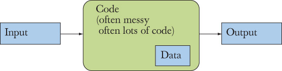
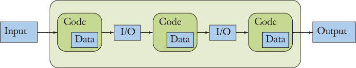
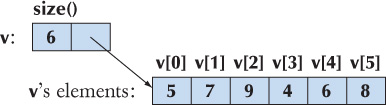
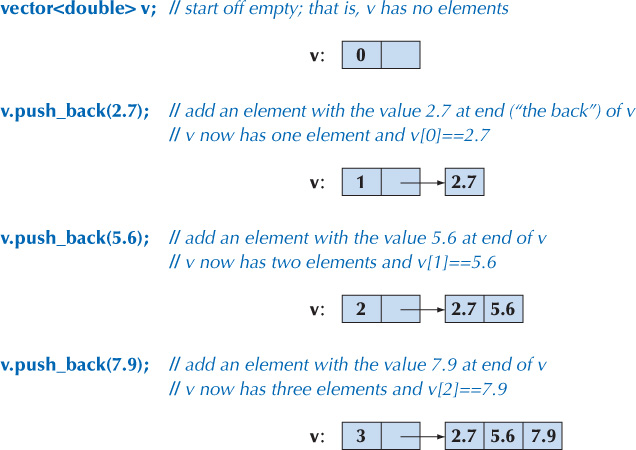

# Computation

All what a computer does is to compute meaning taking an input and computing an output .



To deal with input a program usually contains some data, referred to as its data structure  



A program is usually more complected as inside the program itself shares inputs/outputs between other parts of the program meaning entities such a functions producing a result form a set of input arguments. An argument is a value or address passed to a procedure or function at the time of call (in simpler words ” input “)

Our job as programmers is to express computations 

- Correctly
- Simply
- Efficiently

Our main tool for organizing a program is to break every big computation into a smaller ones. We have to variants for such technique

- **Abstraction**: Hide details that we don’t need to use a facility (“implementation details”) behind a convenient and general interface. For example, rather than considering the details of how to sort a phone book (thick books have been written about how to sort), we just call the sort algorithm from the C++ standard library.Another example is the way we use computer memory. Direct use of memory can be quite messy, so we access it through typed and named variables, vectors, maps, etc.
- **Divide and conquer**: Here we take a large problem and divide it into several little ones. For example, if we need to build a dictionary, we can separate that job into three: read the data, sort the data

Expressions : are the most basic building block of a program and is a symbolic representation of a calculation and may contain variables and operator. Every expression must produce a value 

A **constexpr** symbolic constant must be given a value that is known at compile time. 

But what if we don’t know the value of a constant until run time? For that, C++ offers a second form of constant **a const.**

<details>
    <summary>Here is a list of the most common operators:</summary>


|  | Name | Comment |
| --- | --- | --- |
| f(a) | function call | pass a to f as an argument |
| ++lval | pre-increment  | increment and use the incremented value |
| − −lval | pre-decrement | decrement and use the decremented value |
| !a | not | result is bool |
| –a | unary minus |  |
| a*b | multiply |  |
| a/b | divide |  |
| a%b | modulo (remainder) | only for integer types |
| a+b | add |  |
| a–b | subtract |  |
| out<<b | write b to out | where out is an ostream |
| in>>b | read from in into b | where in is an istream |
| a<b | less than | result is bool |
| a<=b | less than or equal | result is bool |
| a>b | greater than | result is bool |
| a>=b | greater than or equal | result is bool |
| a==b | equal | not to be confused with = |
| a!=b | not equal | result is bool |
| a && b | logical and | result is bool |
| a || b | logical or | result is bool |
| lval = a | assignment | not to be confused with == |
| lval *= a | compound assignment | lval = lval*a; also for /, %, +, – |

lval (short for “value that can appear on the left-hand side of an assignment”)

</details>

Note on conversion 

5/2 is 2 (not 2.5) as it’s int operation 

2.5/2 means 2.5/double(2), that is, 1.25 even if 2 is int it will be promoted to a double 

'a'+1 means int{'a'}+1 

**Statement**: An expression statement is simply an expression followed by a semicolon and a basic unit of a program controlling the execution flow in a function, such as if-statement, for statement, expression statement, and declaration.

Technical details about switch-statements:

**1.** The value on which we switch must be of an integer, char, or enumeration type. 

**2.** The values in the case labels must be constant expressions, you can’t use a variable 

**3.** You cannot use the same value for two case labels.

**4.** You can use several case labels for a single case.

**5.** Don’t forget to end each case with a break

- A function is a named sequence of statements, it can return result or a value
- The syntax of a function definition is *type identifier* ( *parameter-list* ) *function-body*
- We use function as a way to separate computation
- We don’t need to seen a function body to know what a function do, a function declaration is enough, also sometimes we would just type a function declaration and put its definition elsewhere

 

**Vector: “**simply**”** a sequence of elements that can be accessed by an index   



```cpp
vector<int> v = {5, 7, 9, 4, 6, 8};
for (int x : v)        // for each x in v
          cout << x << '\n';
```

This is range-for-loop because the word range is often used to mean the same as “sequence of elements.” We read for (int x : v) as “for each int x in v”. We use the range-for-loop for simple loops over all the elements of a sequence looking at one element at a time. More complicated loops, such as looking at every third element of a vector, looking at only the second half of a vector, or comparing elements of two vectors, are usually better done using the more complicated and more general traditional for-statement.



We add elements to a vector by calling the member function  push_back() using the dot notation 

*member-function-call: object_name.member-function-name ( argument-list )*

```cpp
/ compute mean and median temperatures
int main()
{
          vector<double> temps;                  // temperatures
          for (double temp; cin>>temp; )    // read into temp
                    temps.push_back(temp);     // put temp into vector

          // compute mean temperature:
          double sum = 0;
          for (double x : temps) sum += x;
          cout << "Average temperature: " << sum/temps.size() << '\n';

          // compute median temperature:
          sort(temps);                                     // sort temperatures
          cout << "Median temperature: " << temps[temps.size()/2] << '\n';
}
```

An example of vector usage